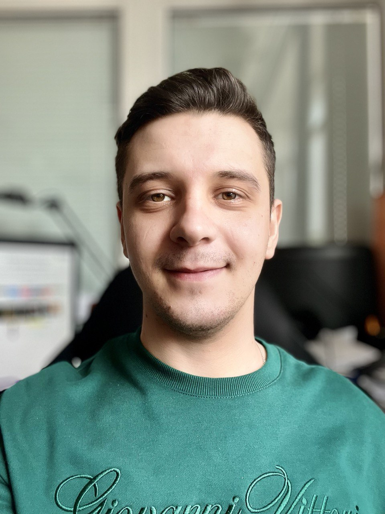
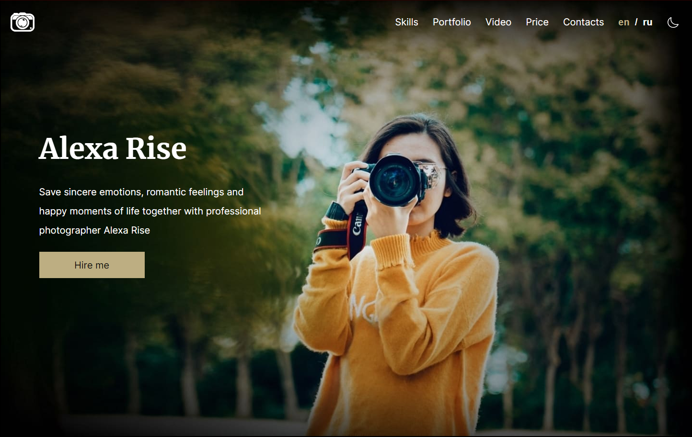
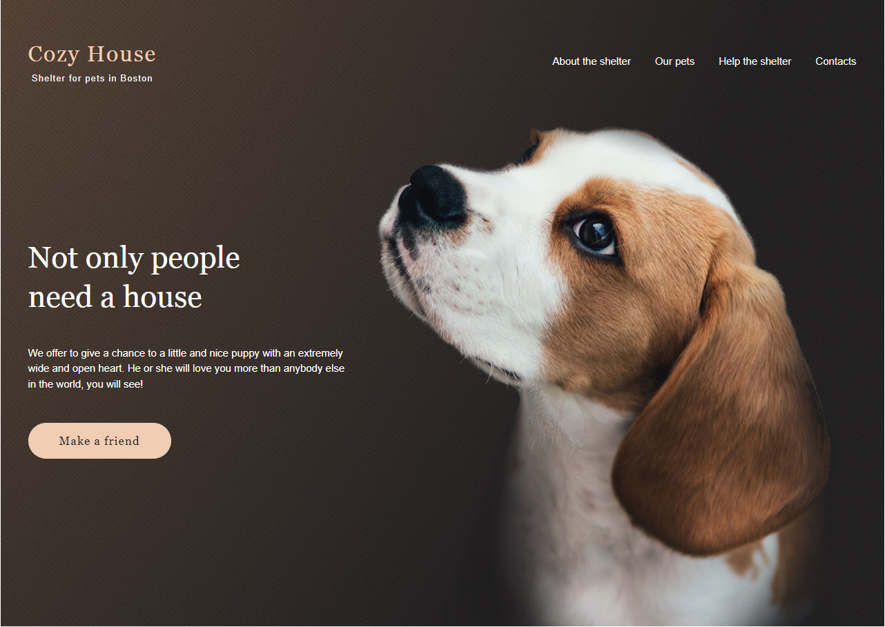
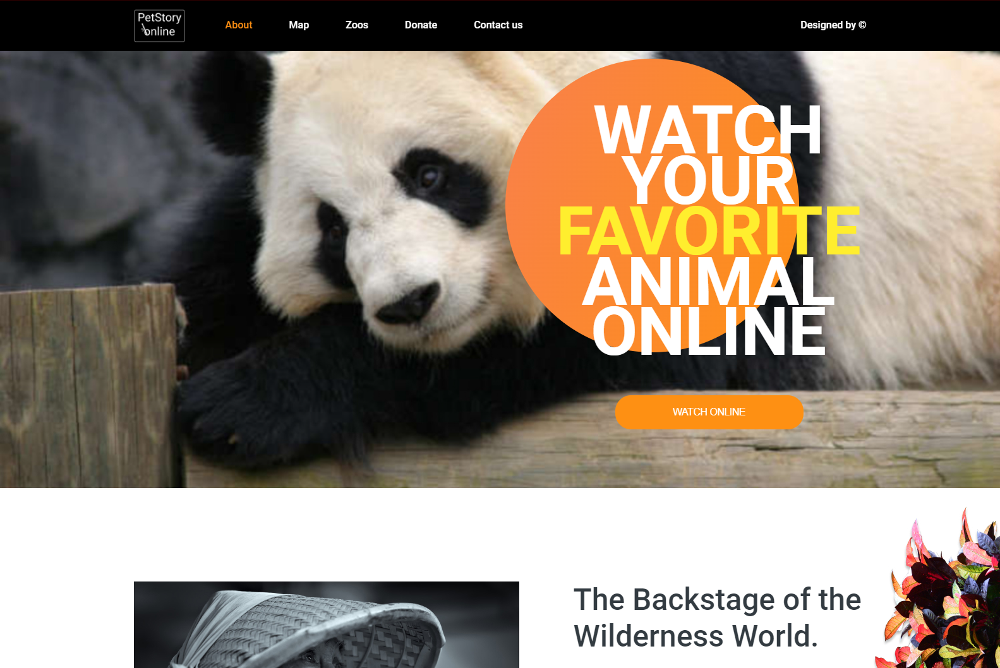
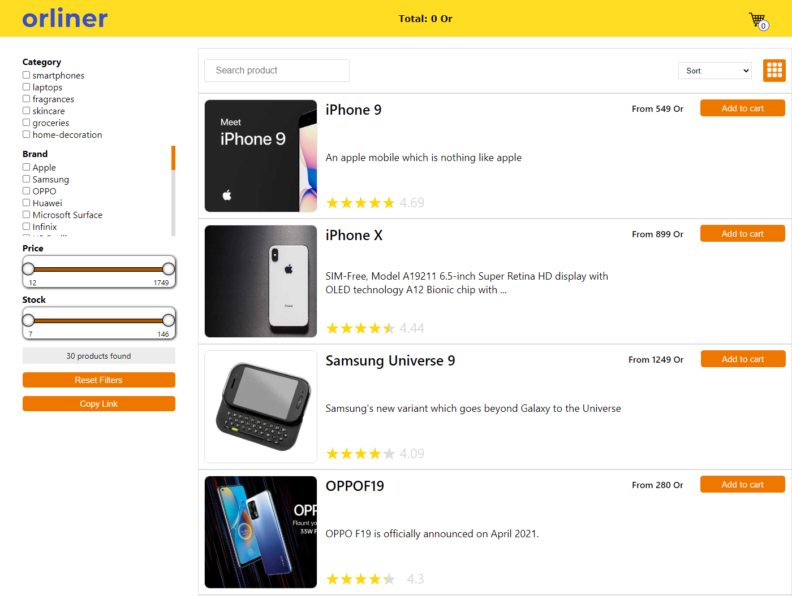
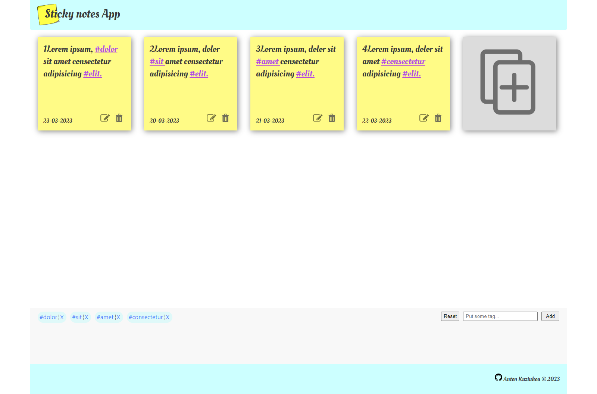
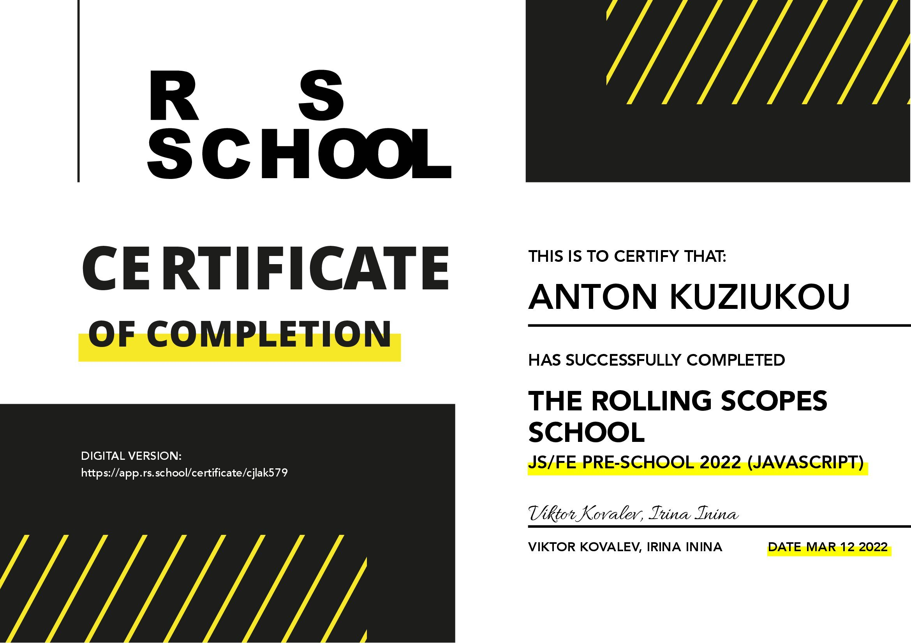
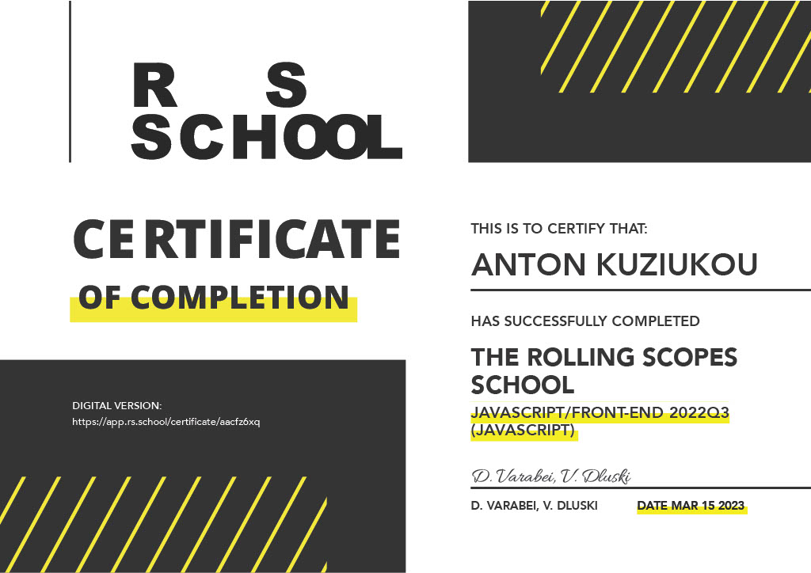

<h2 align="center">Hi there, I'm Anton Kuziukou</h2>
<h4 align="center">Front-end developer from Minsk</h4>

I am a budding frontend developer with a strong commitment to building visually appealing and user-friendly websites. Although I am relatively new to the industry, I have acquired a solid understanding of HTML, CSS, and JavaScript, and I am quickly gaining proficiency in frameworks like React. I am constantly seeking opportunities to expand my knowledge. With a positive attitude, excellent communication skills, and a drive for self-improvement, I am eager to contribute to projects and grow as a frontend developer.

Education: BSUIR, faculty of telecommunications (master)

English level: Intermediate

Phone: +375293764649 | mail: kuzmi495@mail.ru | GitHub: <a href="https://github.com/proboynick">proboynick</a>

<h4 align="center" style="margin-top: 15px">My skills</h4>

</img> </img> </img> </img> </img> </img> </img> </img> </img> </img> </img>

<h4 align="center">My Portfolio</h4>

<a href="https://rolling-scopes-school.github.io/proboynick-JSFEPRESCHOOL/portfolio/" target="_blank"></img></a> <a href="https://rolling-scopes-school.github.io/proboynick-JSFE2022Q1/shelter/pages/main/index.html" target="_blank"></img></a> <a href="https://rolling-scopes-school.github.io/proboynick-JSFE2022Q3/online-zoo/pages/main/" target="_blank"></img></a> <a href="https://viktoriyadatchuk.github.io/online-store/" target="_blank"></img></a> <a href="https://proboynick.github.io/notelist/" target="_blank"></img></a>

<h4 align="center">Courses</h4>

